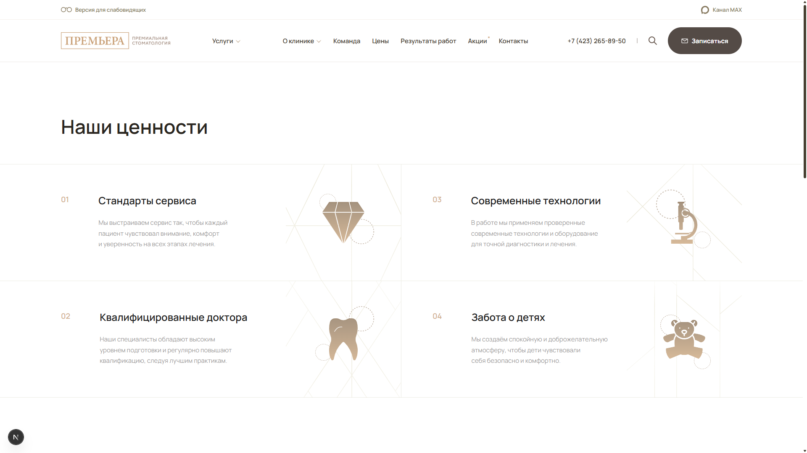
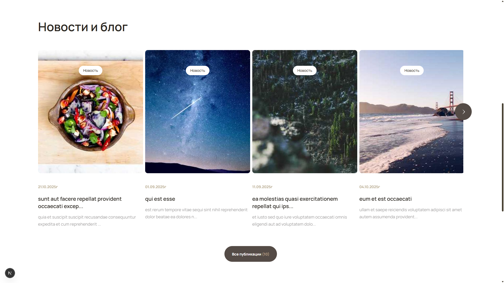
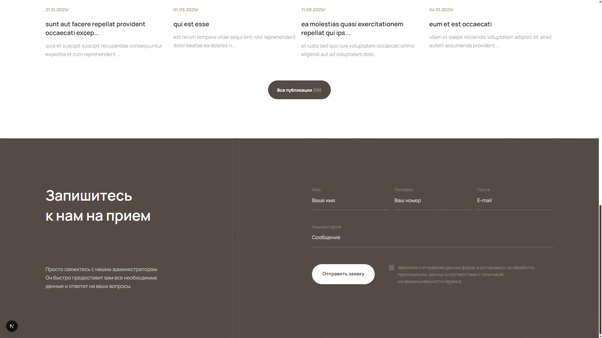

# Next Dentistry

[Test task](https://www.notion.so/frontend-1-2c8df3e94601808299baf24ede7f7bf6) implementation: responsive landing page for a dentistry clinic with contact form and news section.

> Modern landing page built with **Next.js**, **React**, **TypeScript**, and **CSS Modules**.

---

## 🧰 Tech Stack

**Core:**

- **Next.js 16** — React framework with App Router
- **React 19** — UI library
- **TypeScript** — type-safe JavaScript

**UI Components & Styling:**

- **CSS Modules** — modular scoped styles
- **Swiper** — carousel/slider component
- **Headless UI** — unstyled accessible UI components

**Form Handling:**

- **React Hook Form** — form validation and submission
- **React IMask** — phone number input masking
- **React Hot Toast** — toast notifications

**Development Tools:**

- **ESLint** — JavaScript linting
- **Stylelint** — CSS linting
- **Prettier + @trivago/prettier-plugin-sort-imports** — code formatting

---

## 📸 Screenshots

#### Header & Values Section



#### News Section



#### Contact Form



---

## ⚙️ Development

This project uses **Yarn** and requires **Node.js v20+**.

Install dependencies:

```bash
yarn install
```

Run development server:

```bash
yarn dev
```

Build production version:

```bash
yarn build
yarn start
```

Run linters:

```bash
yarn lint
yarn lint:styles
yarn lint:styles:fix
```

---

## 📝 Features

- Fully responsive design matching Figma mockup
- Adaptive header with mobile hamburger menu
- Interactive news carousel with **Swiper**
- Contact form with real-time validation
- AJAX form submission with success/error notifications
- SSR-fetched news section from public mock API

---

**License:** MIT  
**Author:** [Albert Alan-Reys](https://github.com/albert-alanreys)
